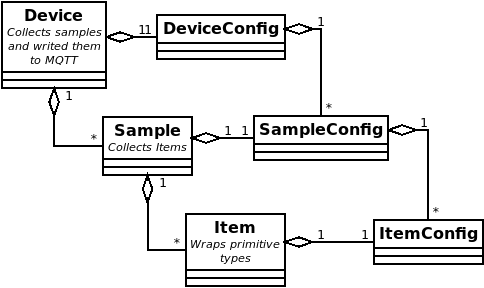
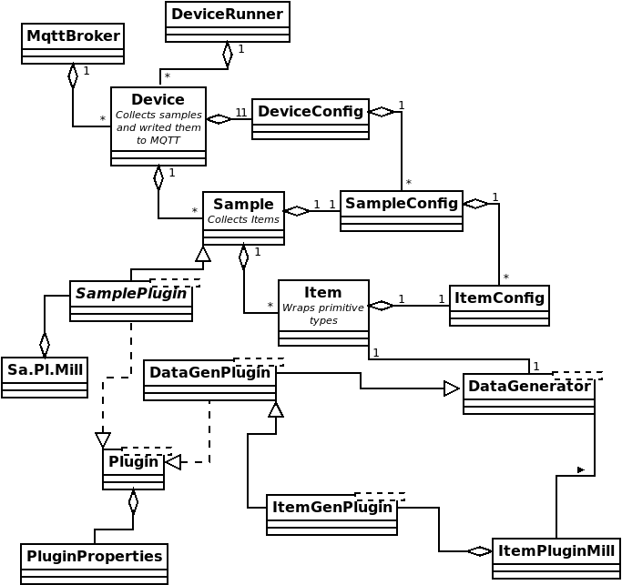

# Bonitoo.io Virtual Device


This project offers virtual devices for testing IoT frameworks communicating through MQTT.  The device runner can start one or more devices, each of which publishes randomly generated data samples as MQTT messages with a JSON payload.  Data samples are made up of a topic, as defined in the MQTT specification, and of the payload.  The default sample payload contains, at a minimum, the sample ID, a timestamp of when the sample was generated, and other configurable items containing randomly generated values.

*Generated default payload example.*

```json
{
     "id":"4aecb712-5e9a-40f5-8747-4e418af457aa",
     "timestamp":1680090571347,
     "appLabel":"radiance",
     "lumens":691.7
}
```
The project is designed to be extensible through plugins.  With an Item plugin it is possible to use custom data generators for values in payload fields.  With a Sample plugin it is possible to design all together custom payloads, that need not conform to the default structure.

The project is drawn together through the base `DeviceRunner` class.  It also provides a subscriber utility.

* `DeviceRunner` - sets up and runs a list of devices.
* `Mqtt5Subscriber` - included as a simple utility for subscribing to topics and inspecting MQTT broker messaging.

**Basic Structure**

When working with virtual devices in this project, keep in mind that the following class structure, from the bottom up, is used:

   * _Data Generator_ - generates primitive values of type Long, Double or String.
   * _Item_ - encapsulates the results of a Data Generator adding to them a label and a name, so that the item can be handled elsewhere. 
   * _Sample_ - encapsulates a set of Items adding with them an MQTT topic and a timestamp of when they were generated.
   * _Device_ - encapsulates a set of Samples, schedules the value updates and handles communication with the MQTT broker. 
   * _DeviceRunner_ - encapsulates a set of Devices, manages their threads and sets up the broker client.  

**Configurability**

Devices are fully configurable using a runner configuration YAML file.  Internally devices can use a standard numeric or string generator to create values for primitive payload item fields.  More sophisticated random value generators can be added through the [Item Plugins](plugins/README.md#Item-plugins) API. The [Sample Plugins](plugins/README.md#Sample-plugins) API permits the creation of more complex sample payloads.   

## System requirements

This project relies upon: 

   * Java SE 17
   * Maven 3.5.6

For best results it should be built with these versions or higher of these platforms.  Please ensure that they are installed before proceeding. 

Support scripts are written in bash to be run on linux.  Bash version 5.1.16 was used. 

## Quick Start

For a quick peek at what this project does and how it works, try  `scripts/quickStart.sh`.  This will
   1. quick build the project, if not already built. 
   1. start a Mosquitto MQTT5 broker container on `localhost`, if not already running. 
   1. start the built-in listener. 
   1. copy plugins to the `plugins` directory, if required by the scenario. 
   1. run the publisher for a few seconds. 
   1. read the subscriber log for comparison with the publisher log.
   1. remove any copied plugins. 
   1. tear down the listener and broker.

It offers six simple scenarios. 

   * `no args` - runs a simple scenario without plugins.
   * `nrf9160` - runs with the `runner.conf` file set to `examples/nrf9160/thingy91.yml`
   * `itemPlugin` - runs a scenario with the accelerator item plugin.
   * `itemPluginRich` - runs a richer scenario with the simpleMovingAverage item plugin.
   * `samplePlugin` - runs a scenario with the lpFileReader sample plugin.
   * `tlsBasic` - runs the simple scenario without plugins but sets up mosquitto to accept only TLS connections at the default TLS port - 8883.

For example: 

```bash
$ scripts/quickStart.sh 
Connection to 127.0.0.1 1883 port [tcp/*] succeeded!
Found Mosquitto at 1883
Mqtt5Subscriber started with PID 37103.  Output piped to scripts/mqtt5subscriber.log


RUNNING BASIC EXAMPLE
=======================
2023-05-26T14:59:07.698+0200 [main] INFO Config - config: Reading base config - virtualdevice.props
...
```

## Basic Tasks

### Build

To build a snapshot jar run the following.  

```shell
mvn clean package
```

This will generate a runnable `virtual-device-<version>-<githash>.jar` file.

### Run the subscriber utility

The MQTT5Subscriber class is a simple utility useful in verifying published messages.  By default, it seeks to connect to an MQTT broker running at `localhost:1883`.  It then subscribes to the topic `test/#` but this can be changed with the property `sub.topic`, eg `-Dsub.topic=stoker/co2`.  To start a dockerized instance of the Mosquitto broker see the [Mosquitto](#starting-mosquitto-docker) section below. 

MQTT5Subscriber is currently runnable only as a compiled class.  This is most easily done through maven.

```sh
mvn exec:java -Dmain.class="io.bonitoo.qa.Mqtt5Subscriber" 
```

<!-- TODO add info about TLS once it is universalized or unbound from the locally running mosquitto TLS configuration.  See issue https://github.com/bonitoo-io/virtual-device/issues/12  -->

### Run Default Publisher

After building the package through maven, the publisher can be run either directly as a class with Maven, or through the packaged jar.

Through Maven:

```shell
mvn exec:java
```

As a jar (_e.g._):

```shell
java -jar target/virtual-device-0.1-SNAPSHOT-4c6be4c.jar
```

This uses the default runner configuration yaml declared in `virtualdevice.props`.  

An alternate runner config can be specified in that file or through the JVM property `runner.conf`.  The value of this property can be either a file name on the classpath or a path to a file.  

For example:

```shell
cp plugins/examples/accelerator/accelerator-0.1-SNAPSHOT.jar plugins; \
java -Drunner.conf=plugins/examples/accelerator/sampleRunnerConfig.yml -jar target/virtual-device-0.1-SNAPSHOT-b012863.jar; \
rm plugins/accelerator-0.1-SNAPSHOT.jar
```
**Runner.sh**

The script `scripts/runner.sh` simplifies launching a publisher.  It wraps the above commands, so that all that is needed is a command line argument for the path to the runner configuration file to be used. If a publisher requires a plugin, this needs to be added to the `plugins` directory before executing the script. 

_example:_

```bash
scripts/runner.sh src/test/resources/simpleRunnerConfigToAWSTestbed.yml
```

## Lifecycle

The life of the device runner is determined by the configuration value `ttl` in the configuration yaml or, if this is not defined, by the property `default.ttl` in `virtualdevice.props`.  It determines in milliseconds the length of time that the runner should keep generating values.  The overall lifecycle consists of four basic phases.

1. **Load Plugins** - the first task that the device runner undertakes is to scan the `plugins` directory for any generator plugins and then adds them to the runtime.  These are jar files whose main classes extend the `DataGenerator` class. 
2. **Read Runner Configuration** - the runner configuration YAML file is then parsed and the items, samples and devices defined within get instantiated and coupled together.
3. **Generate Samples** - each device is isolated in its own thread.  Devices then generate sample data and send messages to the MQTT broker at intervals determined in milliseconds by the `interval` configuration property.
4. **Shutdown** - once the TTL point is reached, the device runner ends all device threads and terminates the run.  

## System Configuration

Base configuration of default values including the location of the runner configuration file is currently handled in the file `src/main/resources/virtualdevice.props`.  The most important property to be set in this file is `runner.conf` which defines the YAML file for configuring the device runner.

An alternate base property file can be defined through the environment variable `VIRTUAL_DEVICE_CONFIG`.

## Configuring the Generic Device Runner

The file indicated by the `runner.conf` property must be a valid YAML file. It needs to define the following fields.

* `ttl` - time to live in milliseconds or how long the device runner should run.  
* `broker` - a configuration for connecting to an MQTT5 broker (see [below](#broker)).
* `items` - a list of items to be included in a sample.  Item values will be generated randomly (see [below](#items)).
* `samples` - a list of samples bound to a topic and including a payload based on an internal item list (see [below](#samples)).
* `devices` - a list of devices, which will generate the sample messages published to the MQTT5 broker (see [below](#devices)).

### Broker

The broker represents a connection to an MQTT5 broker. It contains...

* `host` - name of the broker host. Defaults to `localhost`.
* `port` - port to which the host is listening. Defaults to `1883`
* `auth` - a configuration for simple authentication.  To connect anonymously this property can be omitted, or the `username` can be left unset. It includes two fields.
  * `username`
  * `password` - currently stored in plain text.
* `tls` - (Optional) if present instructs the broker to connect over TLS.
   * `trustStore` - location of a JKS truststore containing a root certificate that can verify the certificate sent by the server.
   * `trustPass` - password to the truststore.  Can be set encrypted.  Copy results from executing `scripts/encryptPass.sh` into this field.
   * _ENV VARS for tls_ - note that the values for `trustStore` and `trustPass` and also be set using the following environment variables.
      * `VD_TRUSTSTORE` - path to the truststore.
      * `VD_TRUSTSTORE_PASSWORD` - truststore password.  Can be plain text or encrypted as described above. 

### Items

Items represent the primitive elements in a sample, whose values can be randomly generated.  All items require the following:

* `name`
* `label`
* `type` - Five types are currently supported:
  * `Double`
  * `Long`
  * `String`
  * `Plugin` - generates a primitive type from an Item Plugin.
  * `BuiltInTemp` - a builtin temperature generator.
  * other builtins can be added.

Item subtypes will expect additional configuration fields.

#### Numerical Items

`Double` and `Long` types require the following properties.

* `min` - a minimum potential value.
* `max` - a maximum potential value.
* `period` - a sinusoid period to regulate the range of generated values.  A value of 0 will generate no random values and will return either 0 or the mid-range of the max and min values if the spread does not include the value 0.
* Constants - to set a constant value set max and min to the same value and the period to 0.

_Double Item configuration example_
```yaml
  - name: "tension"
    type: "Double"
    label: "bar"
    max: 2.0
    min: -1.0
    period: 1
```

The `Double` type also allows an optional field:

   * `prec` - for setting the decimal precision used when serializing values.  It takes an  integer.

#### String Items

The `String` type requires an array of strings from which one value will be chosen randomly whenever a new value gets generated.

_Item as String constant example_
```yaml
  - name: "appLabel"
    type: "String"
    label: "app"
    values:
      - "luminescence"
```

#### Plugin Items

A plugin item type looks for a generator in an Item Plugin preloaded from the directory `plugins`.  From the item configuration perspective the plugin type requires the following fields. 

* `pluginName` - name of the plugin as set in plugin properties.
* `resultType` - the primitive type the plugin generates: e.g. `Double`,`Long`,`String`.

Custom configuration classes can be added to a plugin.  This supports the extension of an Item configuration to any other fields that a custom plugin might need to support.

_Item Plugin example_
```yaml
    - name: "speed"
      label: "speed"
      type: "Plugin"
      pluginName: "AcceleratorPlugin"
      resultType: "Double"
```

### Samples

A sample represents a collection of data items to be published together using a specific topic.  The following properties are required.

* `id` - an identifier for the sample.  The word `random` will result in the internal generation of a random UUID string.
* `name` - a name for the sample, used primarily for handling and reusing samples in different devices.
* `topic` - The MQTT topic under which the sample is published.
* `items` - an array that can include either the names of previously defined items or new inline item definitions as above.

_Basic Sample configuration example_
```yaml
  - id: "random"
    name: "alpha"
    topic: "test/alpha"
    items:
      - "tension"
      - "nuts"
```

### Devices

This penultimate layer represents an array of devices to be run.  Each device requires the following properties.

* `id` - an identifier for the device.  Here again the value `random` leads to an internally generated random UUID.
* `name` - a name for the device.
* `description` - explanatory note about the device.
* `interval` - the interval in milliseconds that a device instance will wait before generating and then publishing new samples.
* `jitter` - an offset in milliseconds for an additional short wait, useful when publishing samples from more than one device of the same type.
* `count` - the number of devices of the type being defined to be created.  Default is 1.  If more than one device is run then its id and the id's of its samples will include a serial number suffix.
* `samples` - an array of samples to be generated by the device.  These can be strings matching names of previously defined samples, or they can be inline definitions as above.

_Basic Generic Device configuration example_
```yaml
  - id: "random"
    name: "Test Device 01"
    description: "testing device configuration"
    interval: 1000
    jitter: 0
    count: 1
    samples:
      - "alpha"
      - "beta"
```
### Runner

Devices are then drawn together in the runner config, along with fields for configuring the broker connection.

A sample runner config:

```yaml
---
ttl: 10000
broker:
  host: localhost
  port: 1883
  auth:
    username: fred
    password: changeit
items:
  - name: "tension"
    type: "Double"
    label: "bar"
    max: 2.0
    min: -1.0
    period: 1
  - name: "nuts"
    type: "Long"
    label: "nutcount"
    max: 100.0
    min: 1.0
    period: 1
  - name: "label"
    type: "String"
    label: "label"
    values:
      - "Salted"
      - "unsalted"
      - "smoked"
samples:
  - id: "random"
    name: "alpha"
    topic: "test/alpha"
    items:
      - "tension"
      - "nuts"
  - id: "random"
    name: "beta"
    topic: "test/beta"
    items:
      - "label"
      - name: "flowRate"
        label: "cmps"
        type: Double
        max: 30
        min: 5
        period: 2
devices:
  - id: "random"
    name: "Test Device 01"
    description: "testing device configuration"
    interval: 1000
    jitter: 0
    count: 1
    samples:
      - "alpha"
      - "beta"
  - id: "random"
    name: "Test Device 02"
    description: "test device configuration"
    interval: 3000
    jitter: 500
    count: 1
    samples:
      - beta
      - id: "random"
        name: "gammaInline"
        topic: "test/gamma"
        items:
          - name: "radiance"
            type: "Double"
            label: "lumens"
            max: 27
            min: 0.1
            period: 2
          - name: "appLabel"
            type: "String"
            label: "app"
            values:
              - "luminescence"
```
## Connecting over TLS

MQTT brokers used in the runner configuration can run over plain HTTP, which is simple but unsecure.  They can also be configured to connect over TLS.  The following steps are recommended.  

   1. Import a base certificate used for signing or verifying the certificate from the MQTT server into a JKS truststore.  
   2. Add a `tls` node to the broker config section using the following properties. 
      1. `trustStore` - path to the truststore.
      2. `trustPass` - password to the truststore - plain text or encrypted, see below .
      3. `ENV VARS` - note that these properties can be omitted if the corresponding environment variables have been set.  

The `trustPass` value can be encrypted.  The utility `EncryptPass` is included to simplify this step.  
   1. Run `scritps/encryptPass.sh`
   2. When prompted provide the password. 
   3. Copy the result to the `trustPass` node in the configuration file or use it when defining the environment variable `VD_TRUSTSTORE_PASSWORD`.

**Adding a Remote Certificate to the Truststore**

The script `scripts/addCert.sh` can be used to add a certificate to a truststore.  

_example_

```bash
$ scripts/addCert.sh -h 52.53.192.249 -p 8883 -a myCertA
Attempting to add alias <myCertA> to store ./scripts/keys/brokerTrust.jks
Certificate was added to keystore
```

This basic script accepts the following arguments.

   * `-h|--host` - MQTT server host to which a broker will attempt to connect.
   * `-p|--port` - Port on host where MQTT is listening.  Defaults to 8883.
   * `-a|--alias` - alias for the certificate in the store.
   * `-s|--store` - target truststore.  Note that this can also be set using the environment variable `VD_TRUSTSTORE`.
   * `-pw|--password` - truststore password.  Note that this can also be set using the environment variable `VD_TRUSTSTORE_PASSWORD`
   * `-n|--certname` - name for the temporary certificate used between downlad and import to the truststore.  Deleted on exit by default. 
   * `-k|--keep` - flag indicates that the temporary certificate should not be deleted.
   * `-f|--force` - if the alias already exists in the truststore, delete the current certificate and replace it with a new one. 

## Architecture

*Core Classes*



*Extended Classes*



## Setting up a test ground

This project leverages the Hive MQ client API.  During development, testing was mostly done against Mosquitto, using the Mosquitto docker image.  

### Starting Mosquitto docker

A simple bash script has been provided to start a Mosquitto docker container listening at localhost.  

*Start mosquitto docker*

```shell
scripts/broker.sh start
```
On success the following should be visible in the terminal. 

```
$ scripts/broker.sh start
1680179637: mosquitto version 2.0.15 starting
1680179637: Config loaded from /mosquitto/config/mosquitto.conf.
1680179637: Opening ipv4 listen socket on port 1883.
1680179637: Opening ipv6 listen socket on port 1883.
1680179637: mosquitto version 2.0.15 running
...
```

*Stop mosquitto docker*

```shell
scripts/broker.sh stop
```
*Cleanup local container and local directories*

```shell
scripts/broker.sh clean
```

### HiveMQ docker tips

HiveMQ has also been used during development. 

*Start the broker:*

```shell
docker run --name hive-mq -p 8080:8080 -p 1883:1883 hivemq/hivemq4
```

*Subscribe to a topic:*

The Hive MQ docker image comes with a number of useful internal features, one of which is the CLI client `mqtt`.  This client can be used for subscribing and publishing data to topics.  It can also be used for inspecting generated messages.

To subscribe and inspect virtual device messages.

```shell
docker exec -it hive-mq tools/mqtt-cli/bin/mqtt sub --topic=test/#
```

## Plugins

See the [Plugins README.md](plugins/README.md) documentation. 

## More information

* [MQTT 5.0 Standard](https://docs.oasis-open.org/mqtt/mqtt/v5.0/os/mqtt-v5.0-os.html)
* [Public Hive MQ](https://www.hivemq.com/public-mqtt-broker/)
* [Mosquitto](https://mosquitto.org/)
