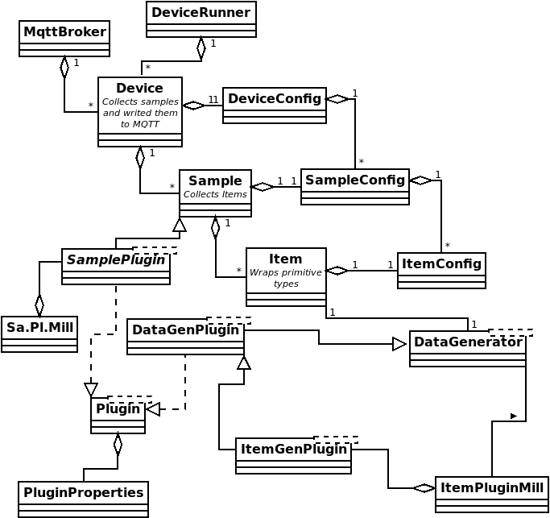

# Bonitoo.io Virtual Device


This project offers virtual devices for testing IoT frameworks communicating through MQTT.  The device runner can start one or more devices, each of which publishes randomly generated data samples as MQTT messages with a JSON payload.  Data samples are made up of a topic as defined in the MQTT specification, and a payload.  The payload contains at a minimum the sample ID, a timestamp of when the sample was generated, and other configurable items containing randomly generated values.

*Generated payload example.*

```json
{
     "id":"4aecb712-5e9a-40f5-8747-4e418af457aa",
     "timestamp":1680090571347,
     "appLabel":"lumens",
     "radiance":6.917
}
```

The project contains two main classes:

* `DeviceRunner` - which sets up and runs a list of devices.
* `Mqtt5Subscriber` - which is included as a simple utility for subscribing to topics and inspecting MQTT broker messaging.

**Configurability**

Devices are fully configurable using a runner configuration YAML file.  Internally devices can use a standard numerical or string generator to create values for payload fields.  More sophisticated random value generators can be added through the Item Plugins interface.  

## System requirements

This project was built using the following: 

   * Java SE 17
   * Maven 3.5.6

For best results it should be built with these versions or higher of these platforms.  Please ensure that they are installed before proceeding. 

Support scripts are written in bash to be run on linux.  Bash version 5.1.16 was used. 

## Build

The build relies on Apache Maven.  To build a snapshot jar run the following.  

```shell
mvn clean package
```

This will generate a runnable `virtual-device-<version>-<githash>.jar` file.

## Run the subscriber utility

The MQTT5Subscriber class is a simple utility useful in verifying published messages.  By default, it subscribes to the topic `test/#` but this can be changed with the property `sub.topic`, eg `-Dsub.topic=stoker/co2`.

MQTT5Subscriber is currently runnable only as a compiled class.  This is most easily done through maven.

```sh
mvn exec:java -Dmain.class="io.bonitoo.qa.Mqtt5Subscriber" 
```

## Run Default Publisher

After building the package through maven, the publisher can be run either directly as a class with Maven, or through the packaged jar.

Through Maven:

```shell
mvn exec:java
```

As a jar:

```shell
java -jar target/virtual-device-0.1-SNAPSHOT-4c6be4c.jar
```

This uses the default runner configuration yaml declared in `virtualdevice.props`.  

An alternate runner config can be specified in that file or through the JVM property `runner.conf`.  The value of this property can be either a file name on the resource classpath or a path to a file.

## Configuration

Base configuration of default values and the location of the runner configuration file is currently handled in the file `src/main/resources/virtualdevice.props`.  The most important property to be set in this file is `runner.conf` which defines the YAML file for configuring the device runner.

An alternate base property file can be defined through the environment variable `VIRTUAL_DEVICE_CONFIG`.

## Configuring a Generic Device Runner

The file indicated by the `runner.conf` property must currently be a valid YAML file. It needs to define the following fields.

* `ttl` - time to live in milliseconds of how long the device runner should run.  
* `broker` - a configuration for connecting to an MQTT5 broker (see below).
* `items` - a list of items to be included in a sample.  Item values will be generated randomly (see below).
* `samples` - a list of samples bound to a topic and including a payload based on an internal item list (see below).
* `devices` - a list of devices, which will generate the sample messages published to the MQTT5 broker (see below).

### Broker

The broker represents a connection to an MQTT5 broker. It contains...

* `host` - name of the broker host. Defaults to `localhost`.
* `port` - port to which the host is listening. Defaults to `1883`
* `auth` - a configuration for simple authentication.  To connect anonymously this property can be omitted, or the `username` can be left unset. It includes two fields.
  * `username`
  * `password` - currently stored in plain text.

### Items

Items represent the primitive elements in a sample, whose values can be randomly generated.  An item requires a name, a label and a type and then fields for defining value limits based on its type.  Five types are currently supported:

* `Double`
* `Long`
* `String`
* `BuiltInTemp` - a builtin temperature generator.
* `Plugin` - a primitive type, whose value is generated by an Item Plugin.
* other builtins can be added.

#### Numerical Items

`Double` and `Long` types require the following properties.

* `min` - a minimum potential value.
* `max` - a maximum potential value.
* `period` - a sinusoid period to regulate the range of generated values.  A value of 0 will generate no random values and will return either 0 or the mid-range of the max and min values if the spread does not include the value 0.
* Constants - to set a constant value set max and min to the same value and the period to 0.

#### String Items

The `String` types require an array of strings from which one value will be chosen randomly whenever a new value gets generated.

#### Plugin Items

A plugin item type looks for a generator in an Item Plugin, which gets preloaded from the directory `plugins`.  A plugin type requires the following fields. 

* `pluginName` - name of the plugin as set in plugin properties.
* `resultType` - the primitive type the plugin generates: e.g. `Double`,`Long`,`String`.

### Samples

A sample represents a collection of data items to be published together to the broker under a specific topic.  The following properties are required.

* `id` - an identifier for the sample.  The word `random` will result in the internal generation of a random UUID string.
* `name` - a name for the sample, used primarily for handling and reusing samples in different devices.
* `items` - this is an array that can include either the names of previously defined items or new inline item definitions as above.

### Devices

This penultimate layer of abstraction represents an array of devices to be run.  Each device requires the following properties.

* `id` - an identifier for the device.  Here again the value `random` leads to an internally generated random UUID.
* `name` - a name for the device.
* `description` - explanatory note about the device.
* `interval` - the interval in milliseconds that a device instance will wait when generating and then publishing new samples.
* `jitter` - an offset in milliseconds for an additional short wait, useful when publishing samples from more than one device of the same type.
* `count` - the number of devices of the type being defined to be created.  Default is 1.  If more than one device is run then its id and the id's of its samples will include a serial number suffix.
* `samples` - an array of samples to be generated by the device.  These can be strings matching names of previously defined samples, or they can be inline definitions as above.

A sample runner config:

```yaml
---
ttl: 10000
broker:
  host: localhost
  port: 1883
  auth:
    username: fred
    password: changeit
items:
  - name: "tension"
    type: "Double"
    max: 2.0
    min: -1.0
    period: 1
  - name: "nuts"
    type: "Long"
    max: 100.0
    min: 1.0
    period: 1
  - name: "label"
    type: "String"
    values:
      - "Salted"
      - "unsalted"
      - "smoked"
samples:
  - id: "random"
    name: "alpha"
    topic: "test/alpha"
    items:
      - "tension"
      - "nuts"
  - id: "random"
    name: "beta"
    topic: "test/beta"
    items:
      - "label"
      - name: "flowRate"
        type: Double
        max: 30
        min: 5
        period: 2
devices:
  - id: "random"
    name: "Test Device 01"
    description: "testing device configuration"
    interval: 1000
    jitter: 200
    count: 3
    samples:
      - "alpha"
  - id: "random"
    name: "Test Device 02"
    description: "test device configuration"
    interval: 3000
    jitter: 0
    count: 1
    samples:
      - beta
      - id: "random"
        name: "gammaInline"
        topic: "test/gamma"
        items:
          - name: "radiance"
            type: "Double"
            max: 27
            min: 0.1
            period: 2
          - name: "appLabel"
            type: "String"
            values:
              - "lumens"
```

## Architecture

*Core Classes*


*Extended Classes*



## Setting up a test ground

This project leverages the Hive MQ client API.  During development testing was mostly done against Mosquitto, using the Mosquitto docker image.  

### Starting Mosquitto docker

A simple bash script has been provided to start a Mosquitto docker container listening at localhost.  

*Start mosquitto docker*

```shell
scripts/broker.sh start
```
On success the following should be visible in the terminal. 

```
$ scripts/broker.sh start
1680179637: mosquitto version 2.0.15 starting
1680179637: Config loaded from /mosquitto/config/mosquitto.conf.
1680179637: Opening ipv4 listen socket on port 1883.
1680179637: Opening ipv6 listen socket on port 1883.
1680179637: mosquitto version 2.0.15 running
...
```

*Stop mosquitto docker*

```shell
scripts/broker.sh stop
```
*Cleanup local container and local directories*

```shell
scripts/broker.sh clean
```

### HiveMQ docker tips

*Start the broker:*

```shell
docker run --name hive-mq -p 8080:8080 -p 1883:1883 hivemq/hivemq4
```

*Subscribe to a topic:*

The Hive MQ docker image comes with a number of useful internal features, one of which is the CLI client `mqtt`.  This client can be used for subscribing and publishing data to topics.  It can also be used for inspecting generated messages.

To subscribe and inspect virtual device messages.

```shell
docker exec -it hive-mq tools/mqtt-cli/bin/mqtt sub --topic=test/#
```

## Plugins

See the [Plugins README.md](plugins/README.md) documentation. 

## More information

* [MQTT 5.0 Standard](https://docs.oasis-open.org/mqtt/mqtt/v5.0/os/mqtt-v5.0-os.html)
* [Public Hive MQ](https://www.hivemq.com/public-mqtt-broker/)
* [Mosquitto](https://mosquitto.org/)
